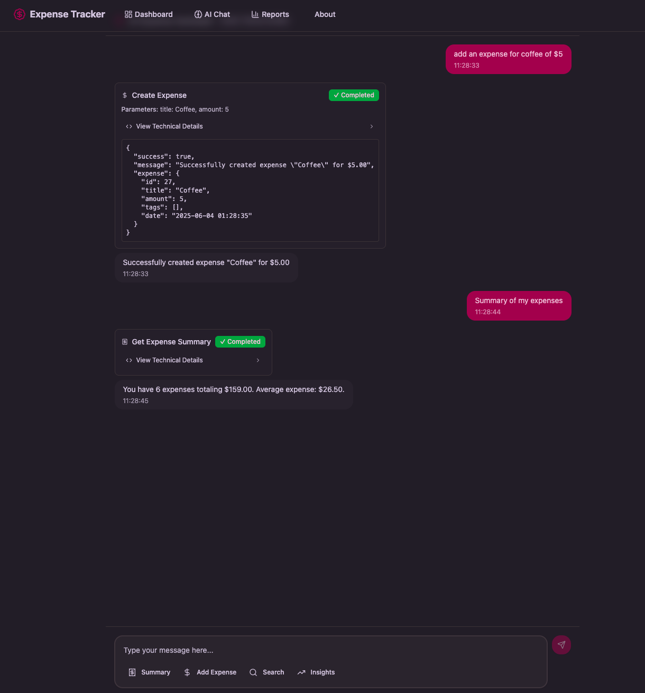

# 🤖💰 Building an AI-Powered Expense Tracker with Modern Web Technologies

🔥 Hono + ⚡ Next.js + 🤖 OpenAI powered expense tracker with natural language processing! Featuring real-time AI chat, smart tagging, and modern full-stack architecture.

:material-link-variant: [Website](https://expense-track-phi-inky.vercel.app/) &nbsp;&nbsp;&nbsp; :fontawesome-brands-github: [github](https://github.com/chandra447/expense-track)


<!-- more -->

## 🎯 Project Overview

The expense tracker is a full-stack web application that allows users to manage their expenses through both traditional UI interactions and an intelligent chat interface. Users can create, categorize, search, and analyze their expenses using natural language commands, making financial management as simple as having a conversation.

### Key Features

- **AI-Powered Chat Interface**: Natural language expense management through OpenAI integration
- **Smart Tagging System**: Organize expenses with custom tags for better categorization
- **Real-time Insights**: Get instant summaries and analytics of spending patterns
- **Secure Authentication**: User management powered by Clerk
- **Responsive Design**: Beautiful, modern UI that works across all devices
- **Tool Calling**: AI can directly interact with the database through structured function calls

## ⚡ Tech Stack Showcase

<div x-data="{ loaded: false }" x-init="setTimeout(() => loaded = true, 100)" class="tech-stack-container" style="margin: 3rem 0; padding: 2rem; background: linear-gradient(135deg, #667eea 0%, #764ba2 100%); border-radius: 16px; overflow: hidden;">

<!-- Main Tech Stack Flow -->
<div class="tech-flow" style="display: flex; align-items: center; justify-content: center; flex-wrap: wrap; gap: 1.5rem; margin-bottom: 2rem;">

<!-- Hono Backend -->
<div x-show="loaded" x-transition:enter="transition ease-out duration-700 delay-100" x-transition:enter-start="opacity-0 transform scale-75 -translate-y-4" x-transition:enter-end="opacity-100 transform scale-100 translate-y-0" style="text-align: center; background: rgba(255,255,255,0.1); backdrop-filter: blur(10px); padding: 1.5rem; border-radius: 12px; border: 1px solid rgba(255,255,255,0.2);">
<svg xmlns="http://www.w3.org/2000/svg" preserveAspectRatio="xMidYMid" viewBox="0 0 256 330" width="60" height="75" style="filter: drop-shadow(0 4px 8px rgba(0,0,0,0.2));">
<path d="M134.129.029c.876-.113 1.65.108 2.319.662a1256.253 1256.253 0 0 1 69.573 93.427c16.094 24.231 29.788 49.851 41.082 76.862 18.037 48.108 8.65 89.963-28.16 125.564-32.209 27.22-69.314 37.822-111.318 31.805-50.208-10.237-84.332-39.28-102.373-87.133C.553 225.638-.993 209.736.614 193.51c2.676-27.93 9.302-54.877 19.878-80.838 4.407-10.592 10.15-20.31 17.228-29.154a381.88 381.88 0 0 1 16.565 21.203c2.44 2.55 4.98 4.98 7.62 7.289C82.06 72.01 106.135 34.685 134.13.029Z" fill="#FF5B11" opacity=".993"/>
<path d="M129.49 53.7c24.314 28.2 46.29 58.238 65.93 90.114a187.318 187.318 0 0 1 15.24 33.13c8.338 32.804-.607 59.86-26.836 81.169-25.367 17.85-53.196 23.15-83.488 15.902-32.666-10.136-51.55-32.113-56.653-65.929-1.238-10.662-.133-21.043 3.314-31.142a225.41 225.41 0 0 1 17.89-35.78l19.878-29.155a5509.508 5509.508 0 0 0 44.726-58.31Z" fill="#FF9758"/>
</svg>
<div style="color: white; margin-top: 0.5rem;"><strong>Hono</strong><br><small style="opacity: 0.8;">Backend API</small></div>
</div>

<!-- Animated Arrow -->
<div x-show="loaded" x-transition:enter="transition ease-out duration-500 delay-300" x-transition:enter-start="opacity-0 transform scale-50" x-transition:enter-end="opacity-100 transform scale-100" style="color: white;">
<svg width="32" height="32" viewBox="0 0 24 24" fill="none" stroke="currentColor" stroke-width="2" stroke-linecap="round" stroke-linejoin="round" style="animation: pulse 2s infinite;">
<line x1="5" y1="12" x2="19" y2="12"></line>
<polyline points="12,5 19,12 12,19"></polyline>
</svg>
</div>

<!-- Next.js Frontend -->
<div x-show="loaded" x-transition:enter="transition ease-out duration-700 delay-200" x-transition:enter-start="opacity-0 transform scale-75 -translate-y-4" x-transition:enter-end="opacity-100 transform scale-100 translate-y-0" style="text-align: center; background: rgba(255,255,255,0.1); backdrop-filter: blur(10px); padding: 1.5rem; border-radius: 12px; border: 1px solid rgba(255,255,255,0.2);">
<svg width="60" height="60" viewBox="0 0 180 180" fill="none" xmlns="http://www.w3.org/2000/svg" style="filter: drop-shadow(0 4px 8px rgba(0,0,0,0.2));">
<mask id="mask0_408_139" style="mask-type:alpha" maskUnits="userSpaceOnUse" x="0" y="0" width="180" height="180">
<circle cx="90" cy="90" r="90" fill="black"/>
</mask>
<g mask="url(#mask0_408_139)">
<circle cx="90" cy="90" r="87" fill="black" stroke="white" stroke-width="6"/>
<path d="M149.508 157.52L69.142 54H54V125.97H66.1136V69.3836L139.999 164.845C143.333 162.614 146.509 160.165 149.508 157.52Z" fill="url(#paint0_linear_408_139)"/>
<rect x="115" y="54" width="12" height="72" fill="url(#paint1_linear_408_139)"/>
</g>
<defs>
<linearGradient id="paint0_linear_408_139" x1="109" y1="116.5" x2="144.5" y2="160.5" gradientUnits="userSpaceOnUse">
<stop stop-color="white"/>
<stop offset="1" stop-color="white" stop-opacity="0"/>
</linearGradient>
<linearGradient id="paint1_linear_408_139" x1="121" y1="54" x2="120.799" y2="106.875" gradientUnits="userSpaceOnUse">
<stop stop-color="white"/>
<stop offset="1" stop-color="white" stop-opacity="0"/>
</linearGradient>
</defs>
</svg>
<div style="color: white; margin-top: 0.5rem;"><strong>Next.js</strong><br><small style="opacity: 0.8;">Frontend Framework</small></div>
</div>

<!-- Animated Arrow -->
<div x-show="loaded" x-transition:enter="transition ease-out duration-500 delay-400" x-transition:enter-start="opacity-0 transform scale-50" x-transition:enter-end="opacity-100 transform scale-100" style="color: white;">
<svg width="32" height="32" viewBox="0 0 24 24" fill="none" stroke="currentColor" stroke-width="2" stroke-linecap="round" stroke-linejoin="round" style="animation: pulse 2s infinite;">
<line x1="5" y1="12" x2="19" y2="12"></line>
<polyline points="12,5 19,12 12,19"></polyline>
</svg>
</div>

<!-- OpenAI -->
<div x-show="loaded" x-transition:enter="transition ease-out duration-700 delay-300" x-transition:enter-start="opacity-0 transform scale-75 -translate-y-4" x-transition:enter-end="opacity-100 transform scale-100 translate-y-0" style="text-align: center; background: rgba(255,255,255,0.1); backdrop-filter: blur(10px); padding: 1.5rem; border-radius: 12px; border: 1px solid rgba(255,255,255,0.2);">
<svg xmlns="http://www.w3.org/2000/svg" width="60" height="60" preserveAspectRatio="xMidYMid" viewBox="0 0 256 260" style="filter: drop-shadow(0 4px 8px rgba(0,0,0,0.2));">
<path fill="#74AA9C" d="M239.184 106.203a64.716 64.716 0 0 0-5.576-53.103C219.452 28.459 191 15.784 163.213 21.74A65.586 65.586 0 0 0 52.096 45.22a64.716 64.716 0 0 0-43.23 31.36c-14.31 24.602-11.061 55.634 8.033 76.74a64.665 64.665 0 0 0 5.525 53.102c14.174 24.65 42.644 37.324 70.446 31.36a64.72 64.72 0 0 0 48.754 21.744c28.481.025 53.714-18.361 62.414-45.481a64.767 64.767 0 0 0 43.229-31.36c14.137-24.558 10.875-55.423-8.083-76.483Zm-97.56 136.338a48.397 48.397 0 0 1-31.105-11.255l1.535-.87 51.67-29.825a8.595 8.595 0 0 0 4.247-7.367v-72.85l21.845 12.636c.218.111.37.32.409.563v60.367c-.056 26.818-21.783 48.545-48.601 48.601Zm-104.466-44.61a48.345 48.345 0 0 1-5.781-32.589l1.534.921 51.722 29.826a8.339 8.339 0 0 0 8.441 0l63.181-36.425v25.221a.87.87 0 0 1-.358.665l-52.335 30.184c-23.257 13.398-52.97 5.431-66.404-17.803ZM23.549 85.38a48.499 48.499 0 0 1 25.58-21.333v61.39a8.288 8.288 0 0 0 4.195 7.316l62.874 36.272-21.845 12.636a.819.819 0 0 1-.767 0L41.353 151.53c-23.211-13.454-31.171-43.144-17.804-66.405v.256Zm179.466 41.695-63.08-36.63L161.73 77.86a.819.819 0 0 1 .768 0l52.233 30.184a48.6 48.6 0 0 1-7.316 87.635v-61.391a8.544 8.544 0 0 0-4.4-7.213Zm21.742-32.69-1.535-.922-51.619-30.081a8.39 8.39 0 0 0-8.492 0L99.98 99.808V74.587a.716.716 0 0 1 .307-.665l52.233-30.133a48.652 48.652 0 0 1 72.236 50.391v.205ZM88.061 139.097l-21.845-12.585a.87.87 0 0 1-.41-.614V65.685a48.652 48.652 0 0 1 79.757-37.346l-1.535.87-51.67 29.825a8.595 8.595 0 0 0-4.246 7.367l-.051 72.697Zm11.868-25.58 28.138-16.217 28.188 16.218v32.434l-28.086 16.218-28.188-16.218-.052-32.434Z"/>
</svg>
<div style="color: white; margin-top: 0.5rem;"><strong>OpenAI</strong><br><small style="opacity: 0.8;">AI Integration</small></div>
</div>

</div>

<!-- Supporting Infrastructure -->
<div x-show="loaded" x-transition:enter="transition ease-out duration-1000 delay-500" x-transition:enter-start="opacity-0 transform translate-y-8" x-transition:enter-end="opacity-100 transform translate-y-0" style="border-top: 1px solid rgba(255,255,255,0.2); padding-top: 2rem;">

<div style="text-align: center; color: white; margin-bottom: 1.5rem;">
<h4 style="margin: 0; font-size: 1.1rem; opacity: 0.9;">Supporting Infrastructure</h4>
</div>

<div style="display: flex; align-items: center; justify-content: center; flex-wrap: wrap; gap: 2rem;">

<!-- Turso Database -->
<div style="text-align: center; background: rgba(255,255,255,0.05); padding: 1rem; border-radius: 8px; border: 1px solid rgba(255,255,255,0.1);">
<svg fill="none" height="40" viewBox="0 0 201 170" width="40" xmlns="http://www.w3.org/2000/svg" style="filter: drop-shadow(0 2px 4px rgba(0,0,0,0.2));">
<path d="m100.055 170c-2.1901 0-18.2001-12.8-21.3001-16.45-2.44 3.73-6.44 7.96-6.44 7.96-11.05-5.57-25.17-20.06-27.83-25.13-2.62-5-12.13-62.58-12.39-79.3-.34-9.41 5.85-28.49 67.9601-28.49 62.11 0 68.29 19.08 67.96 28.49-.25 16.72-9.76 74.3-12.39 79.3-2.66 5.07-16.78 19.56-27.83 25.13 0 0-4-4.23-6.44-7.96-3.1 3.65-19.11 16.45-21.3 16.45z" fill="#1ebca1"/>
<path d="m100.055 132.92c-20.7301 0-33.9601-10.95-33.9601-10.95l1.91-26.67-21.75-1.94-3.91-31.55h115.4301l-3.91 31.55-21.75 1.94 1.91 26.67s-13.23 10.95-33.96 10.95z" fill="#183134"/>
<path d="m121.535 75.79 78.52-27.18c-4.67-27.94-29.16-48.61-29.16-48.61v30.78l-14.54 3.75-9.11-10.97-7.8 15.34-39.38 10.16-39.3801-10.16-7.8-15.34-9.11 10.97-14.54-3.75v-30.78s-24.50997 20.67-29.1799684 48.61l78.5199684 27.18-2.8 37.39c6.7 1.7 13.75 3.39 24.2801 3.39 10.53 0 17.57-1.69 24.27-3.39l-2.8-37.39z" fill="#4ff8d2"/>
</svg>

<div style="color: white; margin-top: 0.5rem; font-size: 0.9rem;"><strong>Turso</strong><br><small style="opacity: 0.7;">SQLite DB</small></div>
</div>

<!-- Drizzle ORM -->
<div style="text-align: center; background: rgba(255,255,255,0.05); padding: 1rem; border-radius: 8px; border: 1px solid rgba(255,255,255,0.1);">
<svg xmlns="http://www.w3.org/2000/svg" width="40" height="40" fill="none" viewBox="0 0 160 160" style="filter: drop-shadow(0 2px 4px rgba(0,0,0,0.2));">
<rect width="9.631" height="40.852" fill="#C5F74F" rx="4.816" transform="matrix(.87303 .48767 -.49721 .86763 43.48 67.304)"/>
<rect width="9.631" height="40.852" fill="#C5F74F" rx="4.816" transform="matrix(.87303 .48767 -.49721 .86763 76.94 46.534)"/>
<rect width="9.631" height="40.852" fill="#C5F74F" rx="4.816" transform="matrix(.87303 .48767 -.49721 .86763 128.424 46.535)"/>
<rect width="9.631" height="40.852" fill="#C5F74F" rx="4.816" transform="matrix(.87303 .48767 -.49721 .86763 94.957 67.304)"/>
</svg>
<div style="color: white; margin-top: 0.5rem; font-size: 0.9rem;"><strong>Drizzle</strong><br><small style="opacity: 0.7;">Type-safe ORM</small></div>
</div>

<!-- Clerk Auth -->
<div style="text-align: center; background: rgba(255,255,255,0.05); padding: 1rem; border-radius: 8px; border: 1px solid rgba(255,255,255,0.1);">
<svg role="img" viewBox="0 0 24 24" xmlns="http://www.w3.org/2000/svg" height="40" width="40" style="filter: drop-shadow(0 2px 4px rgba(0,0,0,0.2));">
<path d="m21.47 20.829 -2.881 -2.881a0.572 0.572 0 0 0 -0.7 -0.084 6.854 6.854 0 0 1 -7.081 0 0.576 0.576 0 0 0 -0.7 0.084l-2.881 2.881a0.576 0.576 0 0 0 -0.103 0.69 0.57 0.57 0 0 0 0.166 0.186 12 12 0 0 0 14.113 0 0.58 0.58 0 0 0 0.239 -0.423 0.576 0.576 0 0 0 -0.172 -0.453Zm0.002 -17.668 -2.88 2.88a0.569 0.569 0 0 1 -0.701 0.084A6.857 6.857 0 0 0 8.724 8.08a6.862 6.862 0 0 0 -1.222 3.692 6.86 6.86 0 0 0 0.978 3.764 0.573 0.573 0 0 1 -0.083 0.699l-2.881 2.88a0.567 0.567 0 0 1 -0.864 -0.063A11.993 11.993 0 0 1 6.771 2.7a11.99 11.99 0 0 1 14.637 -0.405 0.566 0.566 0 0 1 0.232 0.418 0.57 0.57 0 0 1 -0.168 0.448Zm-7.118 12.261a3.427 3.427 0 1 0 0 -6.854 3.427 3.427 0 0 0 0 6.854Z" fill="#fff" stroke-width="1"/>
</svg>
<div style="color: white; margin-top: 0.5rem; font-size: 0.9rem;"><strong>Clerk</strong><br><small style="opacity: 0.7;">Authentication</small></div>
</div>

<!-- Vercel AI SDK -->
<div style="text-align: center; background: rgba(255,255,255,0.05); padding: 1rem; border-radius: 8px; border: 1px solid rgba(255,255,255,0.1);">
<svg viewBox="0 0 256 222" width="40" height="40" xmlns="http://www.w3.org/2000/svg" preserveAspectRatio="xMidYMid" style="filter: drop-shadow(0 2px 4px rgba(0,0,0,0.2));">
<path fill="#fff" d="m128 0 128 221.705H0z"/>
</svg>
<div style="color: white; margin-top: 0.5rem; font-size: 0.9rem;"><strong>Vercel AI</strong><br><small style="opacity: 0.7;">AI SDK</small></div>
</div>

</div>

</div>

</div>

<style>
@keyframes pulse {
  0%, 100% { opacity: 1; }
  50% { opacity: 0.5; }
}

.tech-stack-container {
  position: relative;
}

.tech-stack-container::before {
  content: '';
  position: absolute;
  top: 0;
  left: 0;
  right: 0;
  bottom: 0;
  background: linear-gradient(45deg, transparent 30%, rgba(255,255,255,0.1) 50%, transparent 70%);
  animation: shimmer 3s infinite;
  pointer-events: none;
}

@keyframes shimmer {
  0% { transform: translateX(-100%); }
  100% { transform: translateX(100%); }
}

@media (max-width: 768px) {
  .tech-flow {
    flex-direction: column !important;
  }
}
</style>

**Modern Horizontal Architecture**: This streamlined stack flows from Hono's ultra-fast Edge APIs → Next.js responsive frontend → OpenAI intelligent conversations, supported by Turso's global SQLite performance, Drizzle's type-safe operations, Clerk's secure authentication, and Vercel AI SDK's seamless integration.

## 🛠️ Tech Stack

The project leverages a modern, type-safe tech stack designed for performance and developer experience:

### Frontend
- **Next.js 15** - React framework with App Router for optimal performance
- **React 19** - Latest React features for modern component development
- **Tailwind CSS** - Utility-first CSS framework for rapid UI development
- **Shadcn Components** - Customizable Components
- **Vercel AI SDK** - Seamless AI integration with streaming responses and tool calling

### Backend
- **Hono** - Ultra-fast web framework for the Edge
- **Turso (LibSQL)** - Distributed SQLite database for global performance
- **Drizzle ORM** - Type-safe database operations with excellent TypeScript support
- **Clerk** - Complete authentication and user management solution

### AI & Integration
- **OpenAI GPT-4** - Advanced language model for natural language processing
- **AI SDK Tools** - Structured function calling for database operations
- **Zod** - Runtime type validation for API endpoints

## 🏗️ Architecture Deep Dive

### Database Design

The application uses a clean, normalized database schema with three main entities:

```sql
-- Expenses table
expenses: id, title, amount, userId, createdAt

-- Tags table  
tags: id, tagName, userId, createdAt

--- Chat threads table
chat_threads: user, thread_id, created_timestamp

--- Chat Messages
chat_messages: user, thread_id, message, role(user,AI)
```

This design allows for flexible tagging while maintaining data integrity and enabling efficient queries and as well integrating with Agentic approach

### API Architecture

The backend is built with Hono, providing a lightweight yet powerful API layer:

```typescript
// Modular route structure
const apiRoutes = app
  .route("/expenses", expenseRoute)
  .route("/tags", tagRoute) 
  .route("/credits", creditsRoute)
  .route("/chat", chatRoute);
```

Each route is properly authenticated using Clerk middleware, ensuring users can only access their own data.

### AI Integration

The chat interface uses the Vercel AI SDK with structured tool calling:

```typescript
const result = streamText({
  model: openai('gpt-4o-mini'),
  system: `You are a helpful AI assistant for expense tracking...`,
  messages,
  tools: {
    create_expense: tool({
      description: 'Create a new expense entry',
      parameters: z.object({
        title: z.string(),
        amount: z.number(),
        tagNames: z.array(z.string()).optional(),
      }),
      execute: async ({ title, amount, tagNames }) => {
        // Direct database interaction
      },
    }),
    // Additional tools for search, summary, insights, etc.
  },
});
```

## 🤖 AI-Powered Features

### Natural Language Expense Creation

Users can create expenses using natural language:
- "Add $25 for groceries"
- "I spent $15 on lunch today"
- "Record a $50 expense for gas with transportation tag"

The AI extracts relevant information and creates structured database entries.


*AI-powered chat interface allowing natural language expense creation*


*Real-time expense creation and confirmation showing the AI successfully processed the request*

### Intelligent Search and Filtering

The chat interface supports complex queries:
- "Show me all expenses over $20 from last month"
- "Find my restaurant expenses"
- "What did I spend on groceries this week?"

### Real-time Analytics

Users can get instant insights:
- "Give me my expense summary"
- "Show insights for this month"
- "What's my daily average spending?"

### Smart Tag Management

The AI can automatically suggest and create tags based on expense descriptions, improving organization over time.

## 🎨 User Experience

### Chat Interface Design

The chat interface features:
- **Streaming responses** for real-time feedback
- **Tool execution visualization** showing what actions the AI is performing
- **Collapsible technical details** for transparency
- **Quick action buttons** for common operations
- **Beautiful message bubbles** with timestamps

### Traditional UI Components

Beyond the chat interface, the app includes:
- **Expense list** with filtering and sorting
- **Tag management** with CRUD operations
- **Analytics dashboard** with visual insights
- **User profile** and settings

## 🔒 Security & Authentication

Security is paramount in financial applications:

- **Clerk Authentication**: Secure user management with social logins
- **Row-level security**: Users can only access their own data
- **API rate limiting**: Credit system to prevent abuse
- **Input validation**: Zod schemas for all API endpoints
- **HTTPS everywhere**: Secure data transmission

## 🚀 Performance Optimizations

### Database Performance
- **Indexed queries** for fast expense retrieval
- **Efficient joins** using Drizzle ORM
- **Connection pooling** with Turso

### Frontend Performance
- **Server-side rendering** with Next.js App Router
- **Optimistic updates** for better UX
- **Code splitting** for smaller bundle sizes
- **Image optimization** with Next.js built-ins

### AI Performance
- **Streaming responses** for perceived speed
- **Function calling** for structured operations
- **Context optimization** to reduce token usage

## 📊 Real-World Usage

The application handles common expense management scenarios:

1. **Daily Expense Logging**: Quick entry through chat or forms
2. **Monthly Reviews**: AI-generated summaries and insights
3. **Budget Tracking**: Tag-based categorization for budget analysis
4. **Receipt Processing**: Natural language description parsing
5. **Expense Reporting**: Export capabilities for tax purposes

## 🔮 Future Enhancements

Planned improvements include:

- **Add credits for LLM usage**: Track the number of credits used by the LLM.
- **Budget alerts**: Proactive spending notifications


## 💡 Key Learnings

Building this project taught me valuable lessons:

1. **AI Integration**: Structured tool calling is more reliable than prompt engineering alone
2. **Type Safety**: Zod + TypeScript catches errors before they reach production
3. **User Experience**: Streaming responses make AI interactions feel more natural
4. **Database Design**: Proper normalization prevents data inconsistencies
5. **Authentication**: Clerk simplifies complex user management scenarios

## 🎉 Conclusion

This AI-powered expense tracker demonstrates how modern web technologies can create powerful, user-friendly applications. By combining the intelligence of AI with robust backend architecture and beautiful frontend design, we can build tools that genuinely improve people's daily lives.

The project showcases the potential of conversational interfaces in financial applications, making expense management accessible to users regardless of their technical expertise. As AI continues to evolve, we can expect even more sophisticated interactions and insights.

---

*Want to see the code? Check out the [GitHub repository](https://github.com/chandra447/expense-track) or try the [live demo](https://expense-track-phi-inky.vercel.app/). Feel free to reach out if you have questions about the implementation or want to discuss similar projects!*

## 🏷️ Tags

`#AI` `#NextJS` `#Hono` `#TypeScript` `#FullStack` `#ExpenseTracker` `#OpenAI` `#Turso` `#ModernWeb` 