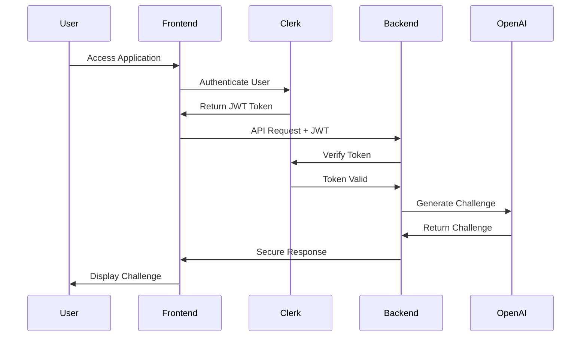

# 🔐🤖 Building a Secure AI-Powered Coding Challenge Platform

In the rapidly evolving world of software development, staying sharp with coding skills is essential. I built a secure, AI-powered platform that generates personalized coding challenges using modern web technologies. This project demonstrates how to combine artificial intelligence with robust security practices to create an educational tool that's both powerful and safe.

🚀 FastAPI + ⚡ React + 🔐 Clerk + 🤖 OpenAI = The ultimate secure coding challenge generator with intelligent question generation and enterprise-grade authentication!

:material-link-variant: [Live Demo](#)     :fontawesome-brands-github: [GitHub Repository](https://github.com/chandra447/ai-interview-prep)     :fontawesome-brands-youtube: [Demo Video](https://youtu.be/U72Hfy1Xfbc)

<!-- more -->

## 🎯 Project Vision

The platform addresses a common challenge in developer education: generating diverse, high-quality coding questions at scale while maintaining user security and preventing abuse. By leveraging AI for content generation and implementing robust authentication, the system provides a personalized learning experience with enterprise-grade security.

### Core Problems Solved

- **Content Scalability**: AI generates unlimited unique coding challenges
- **Security First**: JWT-based authentication with webhook verification
- **Abuse Prevention**: Daily quotas and rate limiting
- **User Experience**: Seamless authentication flow with challenge history
- **Educational Value**: Structured questions with detailed explanations

## 🎬 Live Demo

See the platform in action! This demo showcases the complete user journey from authentication to challenge generation:

<div style="position: relative; width: 100%; height: 0; padding-bottom: 56.25%; margin: 2rem 0; border-radius: 12px; overflow: hidden; box-shadow: 0 10px 30px rgba(0,0,0,0.3);">
<iframe 
    src="https://www.youtube.com/embed/U72Hfy1Xfbc" 
    title="AI-Powered Coding Challenge Platform Demo" 
    frameborder="0" 
    allow="accelerometer; autoplay; clipboard-write; encrypted-media; gyroscope; picture-in-picture; web-share" 
    allowfullscreen
    style="position: absolute; top: 0; left: 0; width: 100%; height: 100%;">
</iframe>
</div>

**🎯 Demo Highlights:**
- **Secure Authentication**: Clerk integration with seamless login
- **AI Challenge Generation**: Real-time question creation with OpenAI
- **Interactive UI**: Modern React interface with smooth animations
- **Quota Management**: Daily limits and usage tracking
- **Challenge History**: Personal archive of completed challenges

## ⚡ Tech Stack Architecture

<div x-data="{ 
    hoveredTech: null,
    techs: [
        { 
            id: 'react', 
            name: 'React Frontend', 
            description: 'Modern UI with TypeScript, Vite, and React Query',
            color: '#58C4DC',
            details: ['React 19.1.0 + TypeScript', 'Vite 6.3.5 with SWC', 'TanStack React Query', 'React Router 7.6.2']
        },
        { 
            id: 'fastapi', 
            name: 'FastAPI Backend', 
            description: 'High-performance Python API with async support',
            color: '#009688',
            details: ['FastAPI + Python 3.13', 'UV package manager', 'SQLAlchemy 2.0.41 ORM', 'Uvicorn ASGI server']
        },
        { 
            id: 'clerk', 
            name: 'Clerk Auth', 
            description: 'Enterprise-grade authentication and user management',
            color: '#6C5CE7',
            details: ['JWT token authentication', 'Webhook verification', 'User profile management', 'CORS protection']
        },
        { 
            id: 'openai', 
            name: 'OpenAI API', 
            description: 'AI-powered challenge generation with GPT-4',
            color: '#74AA9C',
            details: ['GPT-4.1-mini integration', 'Structured JSON output', 'Multiple difficulty levels', 'Fallback system']
        },
        { 
            id: 'ngrok', 
            name: 'Ngrok Tunnels', 
            description: 'Secure webhook development environment',
            color: '#FF6B6B',
            details: ['Secure webhook testing', 'Real-time event handling', 'Local development access', 'Dashboard monitoring']
        }
    ]
}" x-init="
    gsap.from('.tech-card', {duration: 0.6, y: 30, opacity: 0, stagger: 0.1, ease: 'power2.out'});
" class="tech-showcase" style="margin: 3rem 0; padding: 2.5rem; background: linear-gradient(135deg, #667eea 0%, #764ba2 100%); border-radius: 20px; position: relative; overflow: hidden;">

<!-- Background Animation -->
<div style="position: absolute; top: 0; left: 0; right: 0; bottom: 0; background: linear-gradient(45deg, transparent 30%, rgba(255,255,255,0.03) 50%, transparent 70%); animation: shimmer 6s infinite; pointer-events: none;"></div>

<div style="text-align: center; color: white; margin-bottom: 3rem; position: relative; z-index: 2;">
<h3 style="margin: 0; font-size: 2rem; font-weight: 700;">🏗️ System Architecture</h3>
<p style="opacity: 0.9; margin: 1rem 0; font-size: 1.1rem;">Hover over components to explore the tech stack</p>
</div>

<!-- Tech Stack Grid -->
<div style="display: grid; grid-template-columns: repeat(auto-fit, minmax(280px, 1fr)); gap: 2rem; position: relative; z-index: 2;">

<template x-for="tech in techs" :key="tech.id">
<div @mouseenter="hoveredTech = tech.id" 
     @mouseleave="hoveredTech = null"
     class="tech-card"
     style="background: rgba(255,255,255,0.1); backdrop-filter: blur(15px); padding: 2rem; border-radius: 16px; border: 2px solid rgba(255,255,255,0.2); cursor: pointer; transition: all 0.4s ease; text-align: center; position: relative; overflow: hidden;"
     :style="hoveredTech === tech.id ? 'transform: translateY(-8px) scale(1.02); border-color: ' + tech.color + '; box-shadow: 0 20px 40px rgba(0,0,0,0.3);' : ''">

<!-- Tech Icon -->
<div style="width: 80px; height: 80px; margin: 0 auto 1.5rem; display: flex; align-items: center; justify-content: center; border-radius: 16px; transition: all 0.3s ease;"
     :style="'background: ' + tech.color + '; transform: ' + (hoveredTech === tech.id ? 'scale(1.1) rotate(5deg)' : 'scale(1)')">

<!-- React SVG -->
<template x-if="tech.id === 'react'">
<svg width="50" height="45" viewBox="0 0 569 512" xmlns="http://www.w3.org/2000/svg" fill="white">
<path d="M285.5,201 C255.400481,201 231,225.400481 231,255.5 C231,285.599519 255.400481,310 285.5,310 C315.599519,310 340,285.599519 340,255.5 C340,225.400481 315.599519,201 285.5,201"/>
<path d="M568.959856,255.99437 C568.959856,213.207656 529.337802,175.68144 466.251623,150.985214 C467.094645,145.423543 467.85738,139.922107 468.399323,134.521063 C474.621631,73.0415145 459.808523,28.6686204 426.709856,9.5541429 C389.677085,-11.8291748 337.36955,3.69129898 284.479928,46.0162134 C231.590306,3.69129898 179.282771,-11.8291748 142.25,9.5541429 C109.151333,28.6686204 94.3382249,73.0415145 100.560533,134.521063 C101.102476,139.922107 101.845139,145.443621 102.708233,151.02537 C97.4493791,153.033193 92.2908847,155.161486 87.3331099,157.39017 C31.0111824,182.708821 0,217.765415 0,255.99437 C0,298.781084 39.6220545,336.307301 102.708233,361.003527 C101.845139,366.565197 101.102476,372.066633 100.560533,377.467678 C94.3382249,438.947226 109.151333,483.32012 142.25,502.434597 C153.629683,508.887578 166.52439,512.186771 179.603923,511.991836 C210.956328,511.991836 247.567589,495.487529 284.479928,465.972527 C321.372196,495.487529 358.003528,511.991836 389.396077,511.991836 C402.475265,512.183856 415.36922,508.884856 426.75,502.434597 C459.848667,483.32012 474.661775,438.947226 468.439467,377.467678 C467.897524,372.066633 467.134789,366.565197 466.291767,361.003527 C529.377946,336.347457 569,298.761006 569,255.99437"/>
</svg>
</template>

<!-- FastAPI SVG -->
<template x-if="tech.id === 'fastapi'">
<svg width="50" height="50" viewBox="0 0 256 256" xmlns="http://www.w3.org/2000/svg" fill="white">
<path d="M128 0C57.33 0 0 57.33 0 128s57.33 128 128 128 128-57.33 128-128S198.67 0 128 0Zm-6.67 230.605v-80.288H76.699l64.128-124.922v80.288h42.966L121.33 230.605Z"/>
</svg>
</template>

<!-- Clerk SVG -->
<template x-if="tech.id === 'clerk'">
<svg width="50" height="50" viewBox="0 0 24 24" xmlns="http://www.w3.org/2000/svg" fill="white">
<path d="m21.47 20.829 -2.881 -2.881a0.572 0.572 0 0 0 -0.7 -0.084 6.854 6.854 0 0 1 -7.081 0 0.576 0.576 0 0 0 -0.7 0.084l-2.881 2.881a0.576 0.576 0 0 0 -0.103 0.69 0.57 0.57 0 0 0 0.166 0.186 12 12 0 0 0 14.113 0 0.58 0.58 0 0 0 0.239 -0.423 0.576 0.576 0 0 0 -0.172 -0.453Zm0.002 -17.668 -2.88 2.88a0.569 0.569 0 0 1 -0.701 0.084A6.857 6.857 0 0 0 8.724 8.08a6.862 6.862 0 0 0 -1.222 3.692 6.86 6.86 0 0 0 0.978 3.764 0.573 0.573 0 0 1 -0.083 0.699l-2.881 2.88a0.567 0.567 0 0 1 -0.864 -0.063A11.993 11.993 0 0 1 6.771 2.7a11.99 11.99 0 0 1 14.637 -0.405 0.566 0.566 0 0 1 0.232 0.418 0.57 0.57 0 0 1 -0.168 0.448Zm-7.118 12.261a3.427 3.427 0 1 0 0 -6.854 3.427 3.427 0 0 0 0 6.854Z"/>
</svg>
</template>

<!-- OpenAI SVG -->
<template x-if="tech.id === 'openai'">
<svg width="50" height="50" viewBox="0 0 256 260" xmlns="http://www.w3.org/2000/svg" fill="white">
<path d="M239.184 106.203a64.716 64.716 0 0 0-5.576-53.103C219.452 28.459 191 15.784 163.213 21.74A65.586 65.586 0 0 0 52.096 45.22a64.716 64.716 0 0 0-43.23 31.36c-14.31 24.602-11.061 55.634 8.033 76.74a64.665 64.665 0 0 0 5.525 53.102c14.174 24.65 42.644 37.324 70.446 31.36a64.72 64.72 0 0 0 48.754 21.744c28.481.025 53.714-18.361 62.414-45.481a64.767 64.767 0 0 0 43.229-31.36c14.137-24.558 10.875-55.423-8.083-76.483Zm-97.56 136.338a48.397 48.397 0 0 1-31.105-11.255l1.535-.87 51.67-29.825a8.595 8.595 0 0 0 4.247-7.367v-72.85l21.845 12.636c.218.111.37.32.409.563v60.367c-.056 26.818-21.783 48.545-48.601 48.601Zm-104.466-44.61a48.345 48.345 0 0 1-5.781-32.589l1.534.921 51.722 29.826a8.339 8.339 0 0 0 8.441 0l63.181-36.425v25.221a.87.87 0 0 1-.358.665l-52.335 30.184c-23.257 13.398-52.97 5.431-66.404-17.803ZM23.549 85.38a48.499 48.499 0 0 1 25.58-21.333v61.39a8.288 8.288 0 0 0 4.195 7.316l62.874 36.272-21.845 12.636a.819.819 0 0 1-.767 0L41.353 151.53c-23.211-13.454-31.171-43.144-17.804-66.405v.256Zm179.466 41.695-63.08-36.63L161.73 77.86a.819.819 0 0 1 .768 0l52.233 30.184a48.6 48.6 0 0 1-7.316 87.635v-61.391a8.544 8.544 0 0 0-4.4-7.213Zm21.742-32.69-1.535-.922-51.619-30.081a8.39 8.39 0 0 0-8.492 0L99.98 99.808V74.587a.716.716 0 0 1 .307-.665l52.233-30.133a48.652 48.652 0 0 1 72.236 50.391v.205ZM88.061 139.097l-21.845-12.585a.87.87 0 0 1-.41-.614V65.685a48.652 48.652 0 0 1 79.757-37.346l-1.535.87-51.67 29.825a8.595 8.595 0 0 0-4.246 7.367l-.051 72.697Zm11.868-25.58 28.138-16.217 28.188 16.218v32.434l-28.086 16.218-28.188-16.218-.052-32.434Z"/>
</svg>
</template>

<!-- Ngrok SVG -->
<template x-if="tech.id === 'ngrok'">
<svg width="50" height="25" viewBox="0 0 200 92.11" xmlns="http://www.w3.org/2000/svg" fill="white">
<path d="M69.68 34.89c-2.66-2.92-5.95-4.39-9.86-4.39-2.41 0-4.63.46-6.67 1.39-2.04.93-3.8 2.19-5.29 3.8-1.48 1.62-2.65 3.5-3.51 5.68-.86 2.17-1.29 4.52-1.29 7.06 0 2.49.4 4.76 1.19 6.81.8 2.04 1.91 3.79 3.35 5.25 1.44 1.46 3.15 2.6 5.13 3.42 1.98.82 4.15 1.23 6.51 1.23 1.07 0 2.06-.08 2.96-.23.9-.15 1.76-.4 2.58-.74.82-.35 1.62-.79 2.42-1.32.79-.54 1.62-1.22 2.48-2.03v8.67h-.01v.84H58.75l-8.21 9.24v1.59h30.81V31.41H69.68v3.48zm-.03 15.89c-.41.92-.95 1.73-1.61 2.42-.67.69-1.46 1.22-2.38 1.61-.92.39-1.9.58-2.93.58-1.08 0-2.08-.19-3-.58-.92-.39-1.72-.92-2.39-1.61-.67-.69-1.19-1.5-1.58-2.42-.39-.92-.58-1.93-.58-3 0-1.03.2-2 .61-2.9.41-.9.95-1.68 1.65-2.35.69-.67 1.48-1.2 2.38-1.61.9-.41 1.87-.61 2.9-.61.99 0 1.94.19 2.87.58.92.38 1.73.92 2.42 1.61.69.69 1.23 1.48 1.65 2.38.41.9.61 1.89.61 2.97-.01 1.03-.21 2.01-.62 2.93zM37.12 35.43c-.62-.73-1.32-1.36-2.07-1.92-.67-.49-1.38-.92-2.15-1.27-.37-.17-.76-.31-1.17-.44-.59-.19-1.23-.32-1.89-.43h-8.32l-5.5 6.27V31.5H4.35v33.08h11.67V42.26h10.96l.91-.02v22.33h11.67V43.88c0-1.76-.17-3.33-.51-4.71-.34-1.37-.98-2.61-1.93-3.74zm78.55-4.02h-12.73l-5.06 5.7v-5.7H86.2v33.08h11.7l.01-22.14h8.49l9.27-10.48v-.46zm63.06 15.28 15.96-14.72v-.56h-15.38l-12.24 11.93V10.97H155.4v53.51h11.67V51.01l12.83 13.47h15.75v-.63zm-32.45-11.51c-1.78-1.57-3.89-2.79-6.32-3.67-2.43-.88-5.06-1.32-7.9-1.32-2.88 0-5.54.45-7.96 1.35-2.43.9-4.52 2.14-6.29 3.7-1.76 1.57-3.14 3.42-4.13 5.55-.99 2.13-1.48 4.42-1.48 6.87 0 2.71.49 5.17 1.48 7.38s2.35 4.11 4.1 5.7c1.74 1.59 3.81 2.82 6.22 3.68 2.41.86 5.03 1.29 7.87 1.29 2.88 0 5.55-.43 8.03-1.29 2.47-.86 4.59-2.07 6.35-3.65 1.76-1.57 3.15-3.44 4.16-5.61 1.01-2.17 1.52-4.56 1.52-7.19 0-2.62-.5-5.02-1.48-7.19-1-2.16-2.39-4.03-4.17-5.6zm-7.29 15.66c-.41.92-.95 1.73-1.61 2.42-.67.69-1.46 1.22-2.38 1.61-.93.39-1.9.58-2.93.58-1.03 0-2.01-.19-2.94-.58-.92-.39-1.72-.92-2.38-1.61-.67-.69-1.2-1.5-1.61-2.42-.41-.92-.61-1.94-.61-3.06 0-1.03.2-2 .61-2.9.41-.9.94-1.69 1.61-2.38.67-.69 1.46-1.23 2.38-1.61.93-.39 1.9-.58 2.94-.58 1.03 0 2.01.19 2.93.58.92.38 1.72.92 2.38 1.61.67.69 1.2 1.5 1.61 2.42.41.92.61 1.9.61 2.93 0 1.07-.2 2.07-.61 2.99z"/>
</svg>
</template>

</div>

<!-- Tech Name and Description -->
<h4 style="color: white; margin: 0 0 0.5rem 0; font-size: 1.2rem; font-weight: 600;" x-text="tech.name"></h4>
<p style="color: rgba(255,255,255,0.8); margin: 0 0 1rem 0; font-size: 0.9rem; line-height: 1.4;" x-text="tech.description"></p>

<!-- Details List (shown on hover) -->
<div x-show="hoveredTech === tech.id" 
     x-transition:enter="transition ease-out duration-300" 
     x-transition:enter-start="opacity-0 transform translate-y-2" 
     x-transition:enter-end="opacity-100 transform translate-y-0"
     style="text-align: left;">
<template x-for="detail in tech.details" :key="detail">
<div style="color: rgba(255,255,255,0.9); font-size: 0.85rem; margin: 0.3rem 0; padding-left: 1rem; position: relative;">
<span style="position: absolute; left: 0; color: rgba(255,255,255,0.6);">•</span>
<span x-text="detail"></span>
</div>
</template>
</div>

</div>
</template>

</div>

</div>

<style>
@keyframes shimmer {
    0% { transform: translateX(-100%); }
    100% { transform: translateX(100%); }
}

.tech-card:hover {
    background: rgba(255,255,255,0.15) !important;
}

@media (max-width: 768px) {
    .tech-showcase {
        padding: 1.5rem !important;
    }
    
    .tech-showcase h3 {
        font-size: 1.5rem !important;
    }
}
</style>

## 🔐 Security-First Architecture

Security isn't an afterthought—it's built into every layer of the application.

### Authentication Flow



### Security Layers

1. **JWT Authentication**: Clerk-managed tokens with automatic refresh
2. **Webhook Verification**: Svix-powered signature validation
3. **Rate Limiting**: Daily quotas prevent API abuse
4. **CORS Protection**: Configured for secure cross-origin requests
5. **Environment Security**: Secure credential management

## 🤖 AI-Powered Challenge Generation

The heart of the platform lies in its intelligent challenge generation system.

### Challenge Structure

```typescript
interface CodingChallenge {
  question: string;
  options: string[];
  correct_answer: number;
  explanation: string;
  difficulty: 'easy' | 'medium' | 'hard';
  topic: string;
}
```

### AI Prompt Engineering

The system uses carefully crafted prompts to ensure consistent, high-quality output:

```python
def generate_challenge_prompt(difficulty: str, topic: str) -> str:
    return f"""
    Generate a {difficulty} coding challenge about {topic}.
    
    Requirements:
    - Multiple choice with 4 options
    - One correct answer
    - Detailed explanation
    - Practical, interview-style question
    
    Return valid JSON matching the schema.
    """
```

### Intelligent Features

- **Difficulty Scaling**: AI adjusts complexity based on user selection
- **Topic Diversity**: Covers algorithms, data structures, system design
- **Explanation Quality**: Detailed reasoning for learning reinforcement
- **Validation**: Pydantic models ensure data integrity

## 🎯 User Experience Design

### Challenge Generation Flow

<div x-data="{ 
    currentStep: 1,
    steps: [
        { id: 1, title: 'Select Difficulty', icon: '🎯', desc: 'Choose your challenge level' },
        { id: 2, title: 'AI Generation', icon: '🤖', desc: 'OpenAI creates your question' },
        { id: 3, title: 'Answer Challenge', icon: '💭', desc: 'Test your knowledge' },
        { id: 4, title: 'View Results', icon: '📊', desc: 'Learn from explanations' }
    ]
}" x-init="
    setInterval(() => {
        currentStep = currentStep >= 4 ? 1 : currentStep + 1;
    }, 2500);
" class="flow-container" style="margin: 3rem 0; padding: 2.5rem; background: linear-gradient(135deg, #667eea 0%, #764ba2 100%); border-radius: 16px;">

<!-- Header -->
<div style="text-align: center; color: white; margin-bottom: 3rem;">
<h3 style="margin: 0 0 0.5rem 0; font-size: 1.8rem; font-weight: 600;">🔄 Challenge Generation Flow</h3>
<p style="opacity: 0.9; font-size: 1rem; margin: 0;">Watch the process in action</p>
</div>

<!-- Flow Steps -->
<div style="position: relative; max-width: 700px; margin: 0 auto; height: 400px;">

<!-- SVG for Curved Connecting Lines -->
<svg style="position: absolute; top: 0; left: 0; width: 100%; height: 100%; z-index: 1; pointer-events: none;" viewBox="0 0 700 400">
<!-- Step 1 to Step 2 (straight horizontal) -->
<path d="M 175 100 L 350 100" stroke="rgba(255,255,255,0.3)" stroke-width="2" fill="none"/>

<!-- Step 2 to Step 3 (curved down and right) -->
<path d="M 525 100 Q 600 100 600 200 Q 600 300 525 300" stroke="rgba(255,255,255,0.3)" stroke-width="2" fill="none"/>

<!-- Step 3 to Step 4 (straight horizontal) -->
<path d="M 350 300 L 175 300" stroke="rgba(255,255,255,0.3)" stroke-width="2" fill="none"/>

<!-- Animated Dots -->
<!-- Dot 1: Step 1 to 2 -->
<circle r="5" fill="#4ECDC4" x-show="currentStep === 1" style="filter: drop-shadow(0 0 8px #4ECDC4);">
<animateMotion dur="2.5s" repeatCount="indefinite" path="M 175 100 L 350 100"/>
</circle>

<!-- Dot 2: Step 2 to 3 -->
<circle r="5" fill="#4ECDC4" x-show="currentStep === 2" style="filter: drop-shadow(0 0 8px #4ECDC4);">
<animateMotion dur="2.5s" repeatCount="indefinite" path="M 525 100 Q 600 100 600 200 Q 600 300 525 300"/>
</circle>

<!-- Dot 3: Step 3 to 4 -->
<circle r="5" fill="#4ECDC4" x-show="currentStep === 3" style="filter: drop-shadow(0 0 8px #4ECDC4);">
<animateMotion dur="2.5s" repeatCount="indefinite" path="M 350 300 L 175 300"/>
</circle>
</svg>

<!-- Step 1: Select Difficulty -->
<div style="position: absolute; top: 50px; left: 50px; z-index: 2;">
<div style="background: rgba(255,255,255,0.1); backdrop-filter: blur(10px); padding: 1.5rem; border-radius: 16px; border: 2px solid rgba(255,255,255,0.2); text-align: center; width: 200px; transition: all 0.4s ease; transform-origin: center;"
     :style="currentStep === 1 ? 'border-color: #4ECDC4; background: rgba(255,255,255,0.15); transform: translateY(-8px) scale(1.05); box-shadow: 0 15px 35px rgba(0,0,0,0.2);' : ''">

<div style="width: 60px; height: 60px; margin: 0 auto 1rem; border-radius: 12px; background: rgba(255,255,255,0.1); display: flex; align-items: center; justify-content: center; font-size: 1.8rem; transition: all 0.4s ease;"
     :style="currentStep === 1 ? 'background: #4ECDC4; transform: scale(1.15) rotate(5deg);' : ''">
<span>🎯</span>
</div>

<h4 style="color: white; margin: 0 0 0.5rem 0; font-size: 1.1rem; font-weight: 600;">Select Difficulty</h4>
<p style="color: rgba(255,255,255,0.8); margin: 0; font-size: 0.9rem; line-height: 1.4;">Choose your challenge level</p>
</div>
</div>

<!-- Step 2: AI Generation -->
<div style="position: absolute; top: 50px; right: 50px; z-index: 2;">
<div style="background: rgba(255,255,255,0.1); backdrop-filter: blur(10px); padding: 1.5rem; border-radius: 16px; border: 2px solid rgba(255,255,255,0.2); text-align: center; width: 200px; transition: all 0.4s ease; transform-origin: center;"
     :style="currentStep === 2 ? 'border-color: #4ECDC4; background: rgba(255,255,255,0.15); transform: translateY(-8px) scale(1.05); box-shadow: 0 15px 35px rgba(0,0,0,0.2);' : ''">

<div style="width: 60px; height: 60px; margin: 0 auto 1rem; border-radius: 12px; background: rgba(255,255,255,0.1); display: flex; align-items: center; justify-content: center; font-size: 1.8rem; transition: all 0.4s ease;"
     :style="currentStep === 2 ? 'background: #4ECDC4; transform: scale(1.15) rotate(-5deg);' : ''">
<span>🤖</span>
</div>

<h4 style="color: white; margin: 0 0 0.5rem 0; font-size: 1.1rem; font-weight: 600;">AI Generation</h4>
<p style="color: rgba(255,255,255,0.8); margin: 0; font-size: 0.9rem; line-height: 1.4;">OpenAI creates your question</p>
</div>
</div>

<!-- Step 3: Answer Challenge -->
<div style="position: absolute; bottom: 50px; right: 50px; z-index: 2;">
<div style="background: rgba(255,255,255,0.1); backdrop-filter: blur(10px); padding: 1.5rem; border-radius: 16px; border: 2px solid rgba(255,255,255,0.2); text-align: center; width: 200px; transition: all 0.4s ease; transform-origin: center;"
     :style="currentStep === 3 ? 'border-color: #4ECDC4; background: rgba(255,255,255,0.15); transform: translateY(-8px) scale(1.05); box-shadow: 0 15px 35px rgba(0,0,0,0.2);' : ''">

<div style="width: 60px; height: 60px; margin: 0 auto 1rem; border-radius: 12px; background: rgba(255,255,255,0.1); display: flex; align-items: center; justify-content: center; font-size: 1.8rem; transition: all 0.4s ease;"
     :style="currentStep === 3 ? 'background: #4ECDC4; transform: scale(1.15) rotate(5deg);' : ''">
<span>💭</span>
</div>

<h4 style="color: white; margin: 0 0 0.5rem 0; font-size: 1.1rem; font-weight: 600;">Answer Challenge</h4>
<p style="color: rgba(255,255,255,0.8); margin: 0; font-size: 0.9rem; line-height: 1.4;">Test your knowledge</p>
</div>
</div>

<!-- Step 4: View Results -->
<div style="position: absolute; bottom: 50px; left: 50px; z-index: 2;">
<div style="background: rgba(255,255,255,0.1); backdrop-filter: blur(10px); padding: 1.5rem; border-radius: 16px; border: 2px solid rgba(255,255,255,0.2); text-align: center; width: 200px; transition: all 0.4s ease; transform-origin: center;"
     :style="currentStep === 4 ? 'border-color: #4ECDC4; background: rgba(255,255,255,0.15); transform: translateY(-8px) scale(1.05); box-shadow: 0 15px 35px rgba(0,0,0,0.2);' : ''">

<div style="width: 60px; height: 60px; margin: 0 auto 1rem; border-radius: 12px; background: rgba(255,255,255,0.1); display: flex; align-items: center; justify-content: center; font-size: 1.8rem; transition: all 0.4s ease;"
     :style="currentStep === 4 ? 'background: #4ECDC4; transform: scale(1.15) rotate(-5deg);' : ''">
<span>📊</span>
</div>

<h4 style="color: white; margin: 0 0 0.5rem 0; font-size: 1.1rem; font-weight: 600;">View Results</h4>
<p style="color: rgba(255,255,255,0.8); margin: 0; font-size: 0.9rem; line-height: 1.4;">Learn from explanations</p>
</div>
</div>

</div>

<!-- Current Step Text -->
<div style="text-align: center; margin-top: 2rem;">
<p style="color: rgba(255,255,255,0.9); font-size: 1rem; margin: 0;">
<span style="font-weight: 600;">Current Step:</span>
<span x-text="steps[currentStep - 1].title"></span>
</p>
</div>

</div>

<style>
.flow-container {
    position: relative;
}

/* Card hover effects */
.flow-container > div > div:hover {
    transform: translateY(-3px) scale(1.02) !important;
    background: rgba(255,255,255,0.15) !important;
}

@media (max-width: 768px) {
    .flow-container > div:first-child {
        height: 600px !important;
    }
    
    /* Reposition cards for mobile */
    .flow-container > div:nth-child(2) {
        top: 20px !important;
        left: 20px !important;
    }
    
    .flow-container > div:nth-child(3) {
        top: 170px !important;
        right: 20px !important;
    }
    
    .flow-container > div:nth-child(4) {
        top: 320px !important;
        right: 20px !important;
    }
    
    .flow-container > div:nth-child(5) {
        top: 470px !important;
        left: 20px !important;
    }
    
    /* Hide SVG lines on mobile */
    .flow-container svg {
        display: none !important;
    }
    
    /* Make cards smaller on mobile */
    .flow-container > div > div {
        width: 160px !important;
        padding: 1rem !important;
    }
    
    .flow-container h4 {
        font-size: 1rem !important;
    }
    
    .flow-container p {
        font-size: 0.8rem !important;
    }
}

@media (max-width: 480px) {
    .flow-container > div > div {
        width: 140px !important;
        padding: 0.8rem !important;
    }
    
    .flow-container h4 {
        font-size: 0.9rem !important;
    }
    
    .flow-container p {
        font-size: 0.75rem !important;
    }
}
</style>

### Key UX Features

- **Instant Feedback**: Real-time challenge generation
- **Progress Tracking**: Visual quota indicators
- **History Management**: Personal challenge archive
- **Responsive Design**: Seamless mobile experience
- **Error Handling**: Graceful degradation with fallbacks

## 📊 Technical Implementation

### Backend API Design

```python
@app.post("/api/generate-challenge")
async def generate_challenge(
    request: ChallengeRequest,
    user: User = Depends(get_current_user)
):
    # Check daily quota
    if not await check_user_quota(user.id):
        raise HTTPException(status_code=429, detail="Daily quota exceeded")
    
    # Generate AI challenge
    challenge = await ai_generator.create_challenge(
        difficulty=request.difficulty,
        topic=request.topic
    )
    
    # Save to database
    await save_challenge(user.id, challenge)
    
    # Update quota
    await update_user_quota(user.id)
    
    return challenge
```

### Frontend State Management

```typescript
const useChallenge = () => {
  return useQuery({
    queryKey: ['challenge', difficulty],
    queryFn: async () => {
      const response = await fetch('/api/generate-challenge', {
        method: 'POST',
        headers: {
          'Authorization': `Bearer ${await getToken()}`,
          'Content-Type': 'application/json'
        },
        body: JSON.stringify({ difficulty, topic })
      });
      return response.json();
    },
    staleTime: 0 // Always fresh challenges
  });
};
```

### Database Schema

```sql
-- Users managed by Clerk
CREATE TABLE challenges (
    id INTEGER PRIMARY KEY AUTOINCREMENT,
    user_id TEXT NOT NULL,
    question TEXT NOT NULL,
    options JSON NOT NULL,
    correct_answer INTEGER NOT NULL,
    explanation TEXT NOT NULL,
    difficulty TEXT NOT NULL,
    topic TEXT NOT NULL,
    created_at TIMESTAMP DEFAULT CURRENT_TIMESTAMP
);

CREATE TABLE user_quotas (
    user_id TEXT PRIMARY KEY,
    daily_count INTEGER DEFAULT 0,
    last_reset DATE DEFAULT CURRENT_DATE
);
```

## 🚀 Performance Optimizations

### Frontend Optimizations

- **Code Splitting**: Route-based lazy loading
- **React Query**: Intelligent caching and background updates
- **Vite + SWC**: Lightning-fast development builds
- **Bundle Analysis**: Optimized chunk sizes

### Backend Optimizations

- **UV Package Manager**: 10-100x faster than pip
- **SQLAlchemy 2.0**: Async database operations
- **Connection Pooling**: Efficient database connections
- **Response Caching**: Reduced API latency

### AI Integration Optimizations

- **Prompt Caching**: Reuse optimized prompts
- **Fallback Strategies**: Graceful degradation
- **Rate Limiting**: Prevent API quota exhaustion
- **Response Validation**: Ensure data quality

## 🔮 Advanced Features

### Quota Management System

```python
async def reset_daily_quotas():
    """Reset quotas for all users daily"""
    await database.execute("""
        UPDATE user_quotas 
        SET daily_count = 0, last_reset = CURRENT_DATE
        WHERE last_reset < CURRENT_DATE
    """)
```

### Webhook Security

```python
@app.post("/webhooks/clerk")
async def handle_clerk_webhook(request: Request):
    # Verify webhook signature
    payload = await request.body()
    headers = request.headers
    
    try:
        event = svix.Webhook(clerk_webhook_secret).verify(
            payload, headers
        )
    except Exception:
        raise HTTPException(status_code=400, detail="Invalid signature")
    
    # Process user events
    if event["type"] == "user.created":
        await create_user_quota(event["data"]["id"])
    
    return {"status": "success"}
```

## 📈 Real-World Impact

### Educational Benefits

- **Skill Assessment**: Evaluate programming knowledge
- **Interview Preparation**: Practice with realistic questions
- **Continuous Learning**: Daily challenge routine
- **Progress Tracking**: Monitor improvement over time

### Technical Benefits

- **Scalable Architecture**: Handle thousands of users
- **Security Best Practices**: Enterprise-grade protection
- **Modern Stack**: Latest web technologies
- **Developer Experience**: Fast development workflow

## 🔧 Development Workflow

### Local Development Setup

```bash
# Backend setup
cd backend
uv sync
uv run server.py

# Frontend setup
cd frontend
npm install
npm run dev

# Ngrok for webhooks
ngrok http 8000 --domain=your-domain.ngrok-free.app
```

### Environment Configuration

```env
# Required Environment Variables
OPENAI_API_KEY=your_openai_key
CLERK_SECRET_KEY=your_clerk_secret
NGROK_AUTHTOKEN=your_ngrok_token
NGROK_DOMAIN=your-domain.ngrok-free.app
DATABASE_URL=sqlite:///./challenges.db
```

## 💡 Key Learnings

Building this platform taught me valuable lessons about modern web development:

1. **Security First**: Authentication should be built-in, not bolted-on
2. **AI Integration**: Structured outputs are more reliable than free-form text
3. **User Experience**: Real-time feedback improves engagement
4. **Performance**: Modern tools like UV and Vite dramatically improve DX
5. **Architecture**: Clean separation of concerns enables scalability

## 🎉 Conclusion

This secure AI-powered coding challenge platform demonstrates how to build modern, scalable applications that prioritize both user experience and security. By combining cutting-edge AI capabilities with robust authentication and thoughtful architecture, we can create educational tools that are both powerful and safe.

The project showcases the potential of AI in education while maintaining the security standards required for production applications. As AI continues to evolve, platforms like this will play a crucial role in developer education and skill assessment.

---

*Ready to test your coding skills? Try the platform and see how AI can personalize your learning journey while keeping your data secure!*

## 🏷️ Tags

`#AI` `#Security` `#FastAPI` `#React` `#Authentication` `#OpenAI` `#Webhooks` `#Education` `#FullStack` `#ModernWeb` 